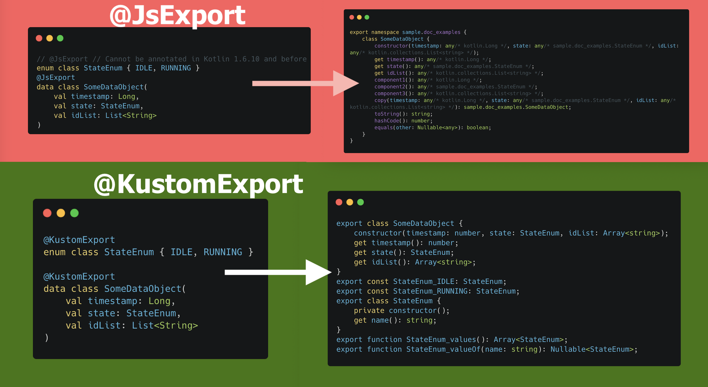

# KustomExport: a KSP generator of JS facade



### Status: Experimental
At Deezer, we develop KMP libraries, this tool help us provide nicer API for Typescript since November 2021.

The generated code will change to support more features and/or stop supporting features provided by KotlinJS directly, so you may expect breaking changes when upgrading.

## Motivation
Providing a nice Typescript API can sometimes be complex/verbose from a Kotlin Multiplatform Project.

A simple example: 
```kotlin
// @JsExport // Cannot be annotated in Kotlin 1.6.10 and before
enum class StateEnum { IDLE, RUNNING }
@JsExport
data class SomeDataObject(
    val timestamp: Long,
    val state: StateEnum,
    val idList: List<String>
)
```
Results in Typescript:

```typescript
export namespace sample.doc_examples {
    class SomeDataObject {
        constructor(timestamp: any/* kotlin.Long */, state: any/* sample.doc_examples.StateEnum */, idList: any/* kotlin.collections.List<string> */);
        get timestamp(): any/* kotlin.Long */;
        get state(): any/* sample.doc_examples.StateEnum */;
        get idList(): any/* kotlin.collections.List<string> */;
        component1(): any/* kotlin.Long */;
        component2(): any/* sample.doc_examples.StateEnum */;
        component3(): any/* kotlin.collections.List<string> */;
        copy(timestamp: any/* kotlin.Long */, state: any/* sample.doc_examples.StateEnum */, idList: any/* kotlin.collections.List<string> */): sample.doc_examples.SomeDataObject;
        toString(): string;
        hashCode(): number;
        equals(other: Nullable<any>): boolean;
    }
}
```

- `Long` will not produce a `number` but a `kotlin.Long` behing a `any` ([doc](https://kotlinlang.org/docs/js-to-kotlin-interop.html#kotlin-types-in-javascript)), but web developers usually use `number` to store timestamp.
- `Enum`s are not handled yet ([KT-37916](https://youtrack.jetbrains.com/issue/KT-37916)) and so exported as `any`
- `List` could be used in a majority of cases if it was exported in Arrays
- Lots of Kotlin methods like componentX, copy, hashCode or equals coming from `data class` are not really relevant or unusable (`copy()` should define all fields in typescript anyway)
- comments in the Typescript generated code is helpful but only comment and doesn't fail build when type changes

There **are** some good reasons why it's not supported by KotlinJs right now, but it's not practical to provide a clean Typescript API.

KustomExport wants to be the bridge to provide a nice Typescript API until KotlinJS produces an equivalent export.

## Technical approach

A manual way to approach this problem is to write a facade in Kotlin and only `@JsExport` the facade.

```kotlin
// jsMain/StateEnumJs.kt
// Export the enum in a class, so it's providing a real class in JS instead of 'any'
@JsExport
class StateEnumJs internal constructor(internal val stateEnum: StateEnum) {
    val name: String = stateEnum.name
}
fun StateEnumJs.import(): StateEnum = value
fun StateEnum.export(): StateEnumJs = Encoding(this)
// Object that exposes all possible values of the enum (note the 's')
@JsExport
object StateEnumsJs {
    val IDLE: StateEnumJs = StateEnumJs(StateEnum.IDLE)
    val RUNNING: StateEnumJs = StateEnumJs(StateEnum.RUNNING)
}
// And more methods like values(), valueOf()...
```

- It doesn't scale easily: lots of boilerplate code to maintain.
- New feature can be invisible when changes are non-breaking with the facade. A dangerous behaviour for library providers.
- It requires calling import()/export() method in many places, leading to a "specific to web" code in your common code.

If you write similar facades yourself, this generator could help you avoid writing them manually. Please open issues with your needs!

>>>Note that it's adding code to your existing codebase, so it will increase your JS bundle size.

## Current status

The current project uses Typescript integration tests, feel free to check what's covered in [Samples](samples/src/commonMain/kotlin/sample).

What is supported today: 
- `Long` to `number` (by using toLong/toDouble, so be careful with precision issues here!) ([doc](doc/Long.md))
- `List<...>` to `Array<...>` and it's ready to support more collections, please open a ticket with your needs.  ([doc](doc/Collection.md))
- enum classes  ([doc](doc/Enum.md))
- class / data class (equals/toString/componentX methods are removed) ([doc](doc/DataClass.md))
- functions and dynamic properties are wrapped (ex `val rand: Long get() = Random.nextLong()` will be wrapped and called again each time the exposed object is called in Typescript)
- interfaces ([doc](doc/Interfaces.md))
- sealed class
- suspend methods with cooperative cancellation (via AbortController)
- removing the namespace (optional) ([doc](doc/Namespace.md))
- mixing `@JsExport` with `@KustomExport` (experimental)

What is not supported yet:
- generics (partially supported, you can generate a list of facades from a single generic class)

Feel free to open issues for more features!

You can have a look to the [Samples](samples/src/commonMain/kotlin/sample) to have a feel of how it can be used.

# Setup

KustomExport use [KSP](https://github.com/google/ksp) (Kotlin Symbol Processor), and you need to install it in your `build.gradle.kts`

```kotlin
plugins {
    kotlin("multiplatform")
    id("com.google.devtools.ksp") version "1.6.21-1.0.5"
}
```

Then you need to define the dependency to the library

```kotlin
repositories {
    mavenCentral()
    maven(url = "https://raw.githubusercontent.com/Deezer/KustomExport/mvn-repo")
}

kotlin {
    // jvm(), js() and other platforms...
    sourceSets {
        val commonMain by getting {
            dependencies {
                implementation("deezer.kustomexport:lib:<version>")
                implementation("deezer.kustomexport:lib-coroutines:<version>")
            }
        }
    }
}
```

And finally enable the compiler with 

```kotlin
kotlin { 
    // KMP configuration
}
dependencies {
    add("kspJs", "deezer.kustomexport:compiler:0.6.1")
}
```

## Licence
```
/*
 * Copyright 2021 Deezer.
 *
 * Licensed under the Apache License, Version 2.0 (the "License");
 * you may not use this file except in compliance with the License.
 * You may obtain a copy of the License at
 *
 *     http://www.apache.org/licenses/LICENSE-2.0
 *
 * Unless required by applicable law or agreed to in writing,
 * software distributed under the License is distributed on an
 * "AS IS" BASIS, WITHOUT WARRANTIES OR CONDITIONS OF ANY
 * KIND, either express or implied.  See the License for the
 * specific language governing permissions and limitations
 * under the License.
 */
```
